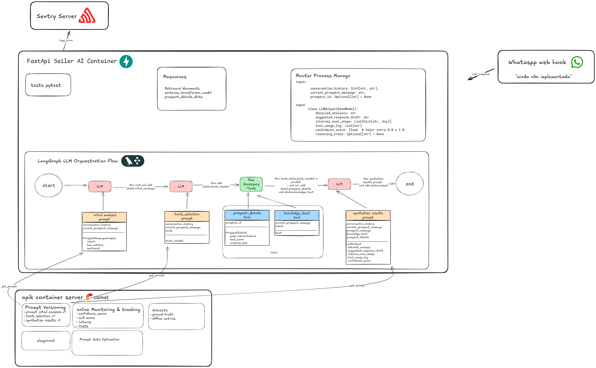

# Sailer AI Agent


## Overview

Sailer AI Agent is an API for automating consultative sales using LLMs, RAG (semantic search), CRM integrations, and custom playbooks. It acts as an autonomous SDR, qualifying, engaging, and converting leads, while integrating with the [Opik](https://github.com/comet-ml/opik) platform for prompt versioning, monitoring, and advanced LLM metrics.

---

## Features

- Lead qualification and intent analysis
- Context-aware, automatic responses
- Strategic follow-ups
- Automatic CRM updates
- Integration with sales systems (Salesforce, Pipedrive, RD Station, etc.)
- Conversation orchestration based on intent and context
- **Opik Integration**:  
  - Prompt versioning & playground  
  - Online monitoring: confidence score, LLM score, latency, costs  
  - Ground truth and offline metrics  
  - Prompt auto-optimization

---

## Architecture

- **FastAPI Sailer AI Container**: Orchestrates the LLM pipeline using LangGraph, with steps for initial analysis, tool selection, tool execution (prospect details, knowledge text), and synthesis of results.
- **Opik Container**: Provides prompt versioning, monitoring, metrics, playground, and optimization.
- **Sentry**: Error logging and monitoring.

See the diagram above for a detailed flow.

---

## Quickstart

### 1. Clone and Start Opik

```bash
git clone https://github.com/comet-ml/opik.git
cd opik
./opik.sh
```

### 2. Start the AI Agent

From this repository's root:

```bash
docker compose up --build
```

### 3. Connect the AI Agent to the Opik Network

After both containers are running:

```bash
docker network connect opik_default ai_agent
```

---

## Environment Variables

Copy `.env.example` to `.env` and fill in your keys:

```bash
cp .env.example .env
# Edit the .env file as needed
```

Main variables:
- `API_PORT`
- `OPENAI_API_KEY`
- `OPIK_BASE_URL`, `OPIK_API_KEY`, `OPIK_URL_OVERRIDE`, `OPIK_PROJECT_NAME`

---

## API Usage

The main endpoint is:

```
POST /api/ai_agent/process_message
```

**Example cURL:**

```bash
curl -X 'POST' \
  'http://localhost:8001/api/ai_agent/process_message?current_prospect_message=How%20can%20Sailer%20AI%20help%20me%20increase%20sales%3F&prospect_id=1' \
  -H 'accept: application/json' \
  -H 'Content-Type: application/json' \
  -d '[]'
```

Replace `current_prospect_message` and `prospect_id` as needed.

---

## Documentation & Healthcheck

- Interactive docs: [http://localhost:$API_PORT/api/ai_agent/docs](http://localhost:$API_PORT/api/ai_agent/docs)
- Healthcheck: [http://localhost:$API_PORT/api/ai_agent/healthcheck](http://localhost:$API_PORT/api/ai_agent/healthcheck)

---

## Testing

Run tests with:

```bash
docker compose exec ai_agent pytest
```
or
```bash
pytest
```

---

## Metrics & Monitoring (via Opik)

- Online confidence score
- LLM score
- Latency
- Costs
- Ground truth & offline metrics
- Prompt versioning & playground
- Prompt auto-optimization

All tracked and visualized in the Opik dashboard.

---

## Folder Structure

```
├── app/
│   ├── main.py                # FastAPI application entrypoint
│   ├── core/                  # Configurations, resources, and settings
│   ├── routers/               # API routes
│   ├── schemas/               # Pydantic schemas
│   └── services/              # AI, FAISS, etc. services
├── faiss_indexes/             # Knowledge base and FAISS indexes
├── opik_utils/                # Opik utility scripts
├── requirements.txt           # Python dependencies
├── Dockerfile                 # Docker image build
├── docker-compose.yml         # Docker orchestration
├── .env.example               # Example environment variables
```

---