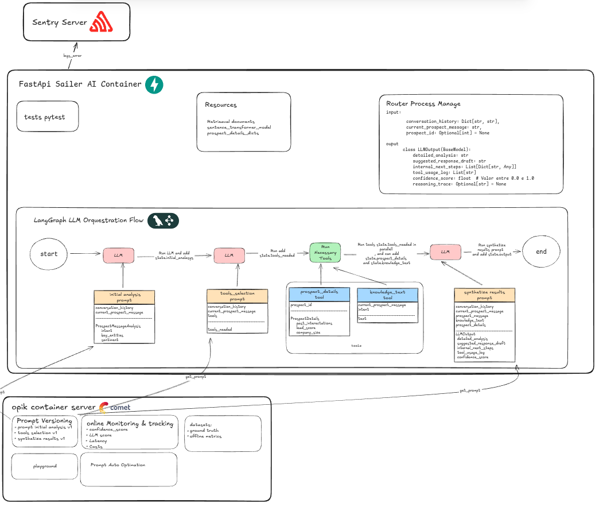

# Sales AI Agent


## Description
Sales AI Agent is an API for automating consultative sales using AI. It qualifies, engages, and converts leads autonomously and efficiently. The solution leverages LLMs, RAG (semantic search), CRM integrations, and custom sales playbooks to act as an expert SDR, automatically responding to leads, scheduling follow-ups, and updating the CRM without human effort.

## Main Features
- Lead qualification and intent analysis
- Context-aware automatic responses
- Strategic follow-ups
- Automatic CRM updates
- Integration with sales systems (Salesforce, Pipedrive, RD Station, etc.)
- Conversation orchestration based on intent and context

## Requirements
- Python 3.11+
- Docker and Docker Compose (recommended for production)

## Installation
### 1. Clone the repository
```bash
git clone <repo_url>
cd letrus-gen-api
```

### 2. Configure environment variables
Copy `.env.example` to `.env` and fill in the required values:
```bash
cp .env.example .env
# Edit the .env file as needed
```

### 3. Install dependencies (local mode)
```bash
python3 -m venv .venv
source .venv/bin/activate
pip install --upgrade pip
pip install -r requirements.txt
```

## Running the API
### Local Mode
```bash
PYTHONPATH=. uvicorn app.main:app --host 0.0.0.0 --port $API_PORT --reload
```

### With Docker
```bash
docker-compose up --build
```

## Documentation & Healthcheck
- Interactive docs: `http://localhost:$API_PORT/api/ai_agent/docs`
- Healthcheck: `http://localhost:$API_PORT/api/ai_agent/healthcheck`

## Folder Structure
```
├── app/
│   ├── main.py                # FastAPI application entrypoint
│   ├── core/                  # Configurations, resources, and settings
│   ├── routers/               # API routes
│   ├── schemas/               # Pydantic schemas
│   └── services/              # AI, FAISS, etc. services
├── faiss_indexes/             # Knowledge base and FAISS indexes
├── opik_utils/                # Opik utility scripts
├── requirements.txt           # Python dependencies
├── Dockerfile                 # Docker image build
├── docker-compose.yml         # Docker orchestration
├── .env.example               # Example environment variables
```

## Environment Variables (.env)
See `.env.example` for all required parameters. Main ones:
- `API_PORT`: API port
- `OPENAI_API_KEY`: OpenAI key
- `OPIK_BASE_URL`, `OPIK_API_KEY`, `OPIK_URL_OVERRIDE`, `OPIK_PROJECT_NAME`: Opik integration

## Usage Example (main endpoint)
```json
POST /api/ai_agent/process_message
{
  "conversation_history": {"1": "Hi, I'd like to know more about the product."},
  "current_prospect_message": "Does your AI work with RD Station?"
}
```
Response:
```json
"Yes! Our system integrates with RD Station, and we can show you a real example."
```

## Tests
Add your tests in `app/tests/`. To run (example with pytest):
```bash
pytest
```

---
For questions, suggestions, or contributions, open an issue or contact us.